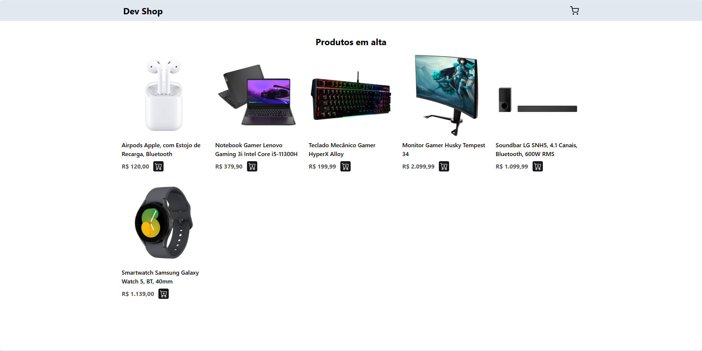
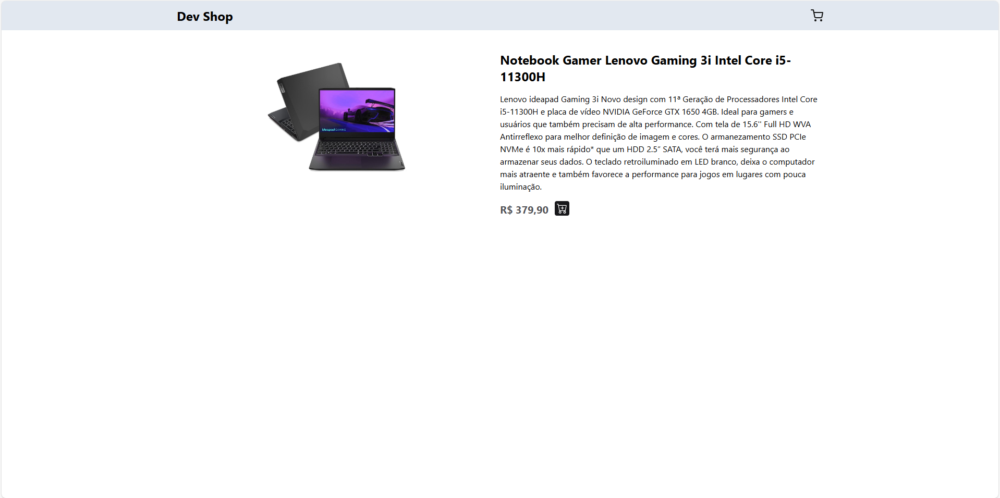
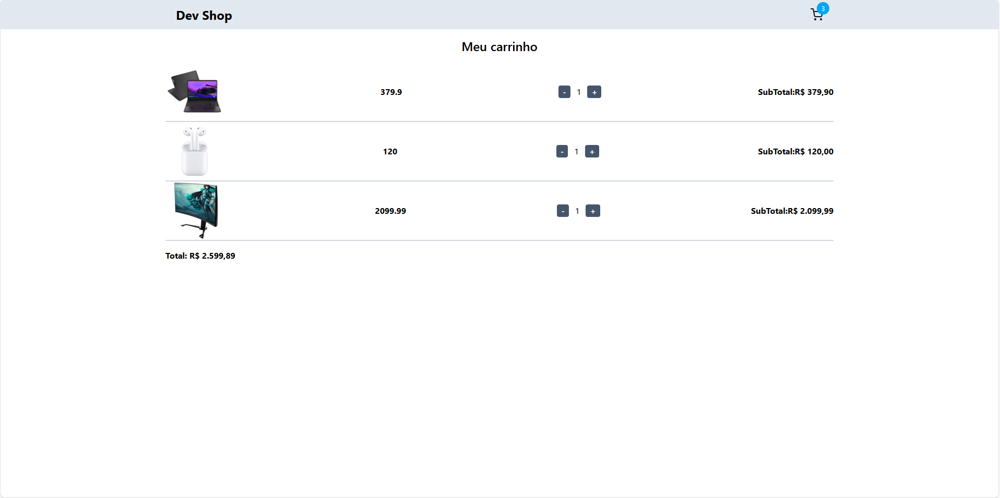

# 🛒 Carrinho de Compras

Aplicação web de **lista de desejos / compras** desenvolvida com **React**, estilizada com **Tailwind CSS**, e integrando uma API mockada com **JSON Server**. O projeto simula um sistema de carrinho de compras com funcionalidades completas, incluindo **listagem**, **visualização de detalhes**, **adição ao carrinho** e **remoção de produtos**.

## 🔧 Tecnologias Utilizadas

- **React.js** – Interface interativa e reativa
- **Tailwind CSS** – Estilização moderna e responsiva
- **Axios** – Consumo de API REST
- **JSON Server** – Simulação de backend local
- **React Router Dom** – Navegação entre páginas
- **React Hooks (useState, useEffect)** – Gerenciamento de estado

## ✨ Funcionalidades

- ✅ Listagem de produtos via API simulada
- ✅ Visualização de **detalhes do produto**
- ✅ Adição e remoção de produtos do carrinho
- ✅ Visualização do carrinho com atualização dinâmica
- ✅ Estilização responsiva com Tailwind CSS

## ▶️ Como Executar o Projeto

### 1. Clone o repositório

```bash
git clone https://github.com/AndreessaLopes/carrinho
cd carrinho
```

### 2. Instale as dependências

```bash
npm install
```

### 3. Inicie o servidor da API (JSON Server)

```bash
npx json-server --watch db.json
```

Esse comando iniciará a API no endereço: `http://localhost:3000`.

> ⚠️ Certifique-se de que o arquivo `db.json` está na raiz do projeto e contém os dados necessários.

### 4. Execute a aplicação

```bash
npm run dev
```

A aplicação será iniciada em: `http://localhost:5173` (ou outra porta conforme seu ambiente).

## 📁 Estrutura de Arquivos

```
src/
├── components/        # Componentes reutilizáveis (cards, botões, etc)
├── pages/             # Páginas da aplicação (Home, Detalhes, Carrinho)
├── services/          # Configuração da API
│   └── api.ts         # Axios com baseURL para JSON Server
├── App.tsx            # Componente principal com rotas
├── main.tsx           # Entrada da aplicação
└── db.json            # Banco de dados simulado (JSON Server)
```

## 💡 Exemplo de Código da API

```ts
// src/services/api.ts

import axios from "axios";

export const api = axios.create({
  baseURL: "http://localhost:3000",
});
```

## 🖼️ Capturas de Tela

### 📌 Listagem de Produtos



### 🔍 Detalhes do Produto



### 🛍️ Carrinho com Itens



## 📄 Licença

Este projeto está licenciado sob a licença MIT.  
Sinta-se livre para usar, estudar, modificar e compartilhar.
